# 🚀 NextGen Place – AI Driven Campus Recruitment Platform

NextGen Place is a web-based campus recruitment system built with **Django** and **MySQL**.  
It connects students, recruiters, and placement officers through a centralized hiring workflow.

---

## ✨ Key Features

- Student registration & login
- Resume and academic profile management
- Company / recruiter job postings
- Online job application system
- Admin monitoring & verification
- AI-style assistance for candidate handling

---

## 🛠 Tech Stack

- **Backend:** Python, Django  
- **Database:** MySQL  
- **Frontend:** HTML, CSS  
- **Authentication:** Django session auth  

---

## ⚙️ Installation & Setup

```bash
git clone https://github.com/Madhavang-codes/NextGen-Place---AI-Driven-Campus-Recruitment-Platform.git
cd nextgen_place

# create virtual environment (optional)
python -m venv venv
venv\Scripts\activate

pip install -r requirements.txt

# apply migrations
python manage.py migrate

# run server
python manage.py runserver

## 📁 Modules

- Student Module
- Employer / Recruiter Module
- Job Posting & Management
- Application Tracking
- Placement Administration

---

## 🚧 Future Enhancements

- Resume ranking using Machine Learning
- Interview scheduling
- Cloud deployment (AWS / Render)

---

## 👨‍💻 Author

**Madhavan**  
MCA Student | Aspiring Backend Developer

## 📸 Application Screenshots

### 🏠 Home & Authentication
<p align="center">
  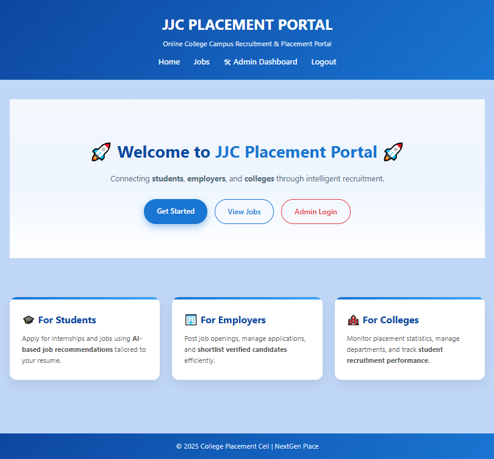
  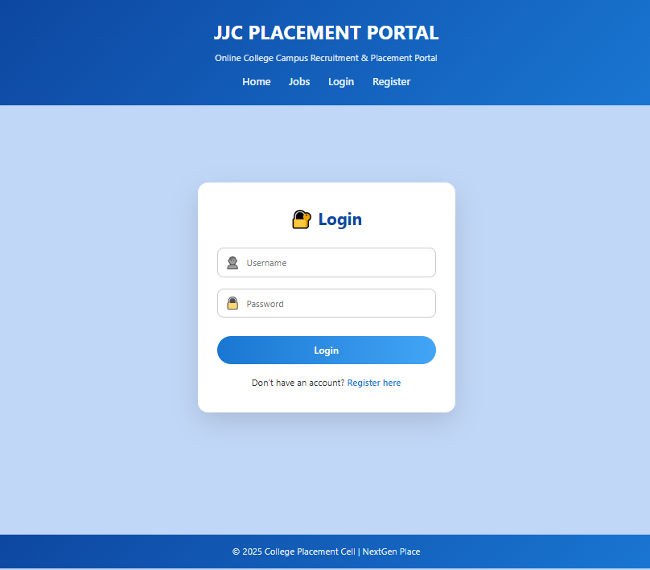
</p>

<p align="center">
  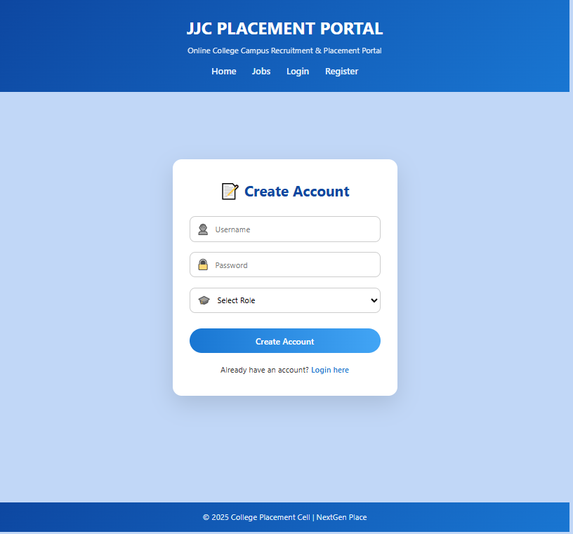
</p>

---

### 🎓 Student Module
<p align="center">
  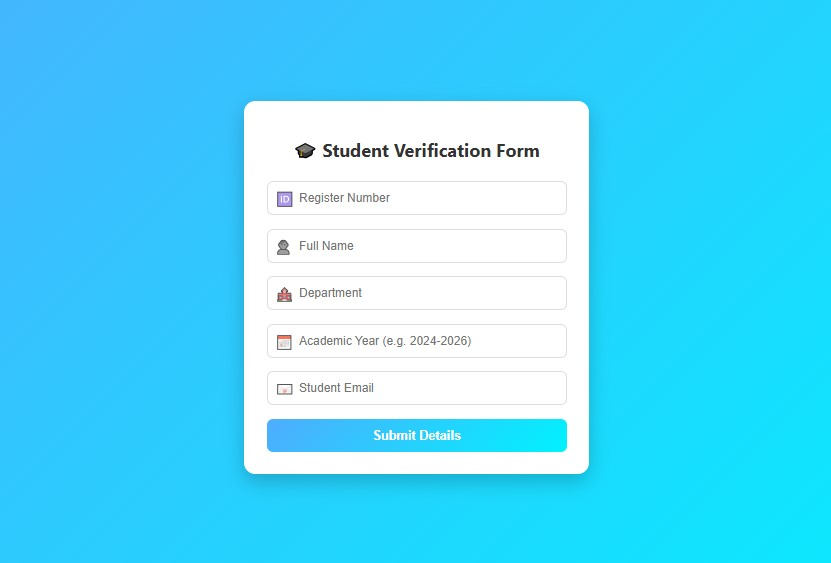
  
</p>

<p align="center">
  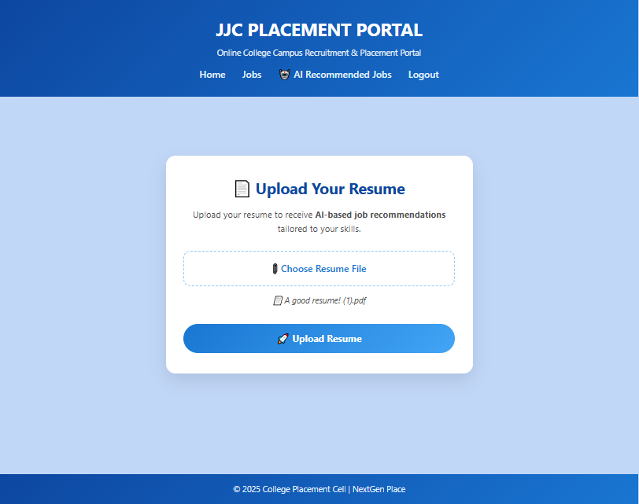
  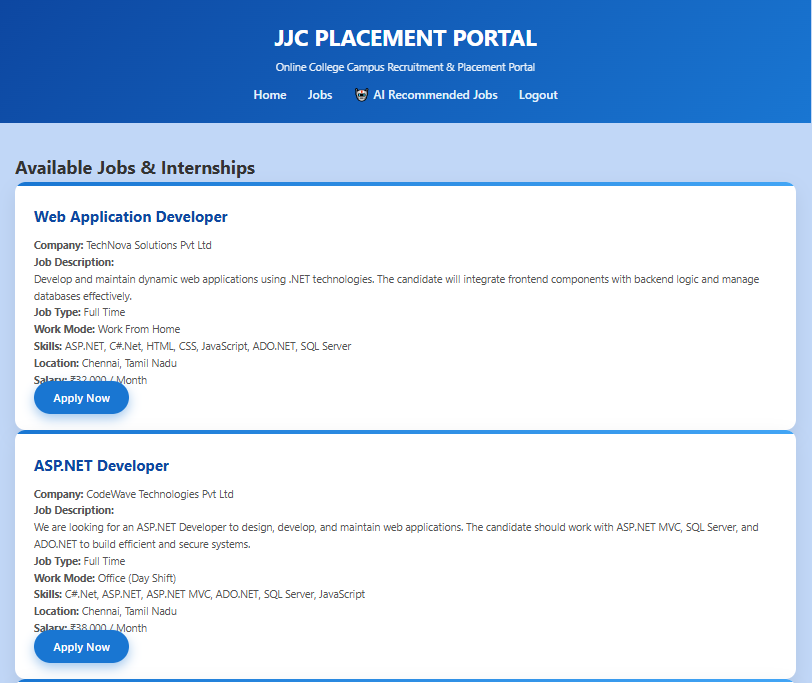
</p>

---

### 🏢 Employer Module
<p align="center">
  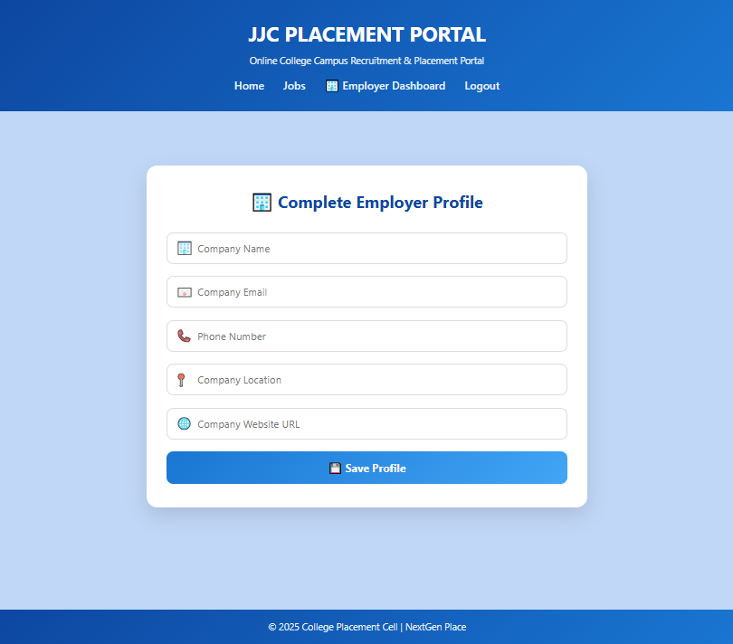
  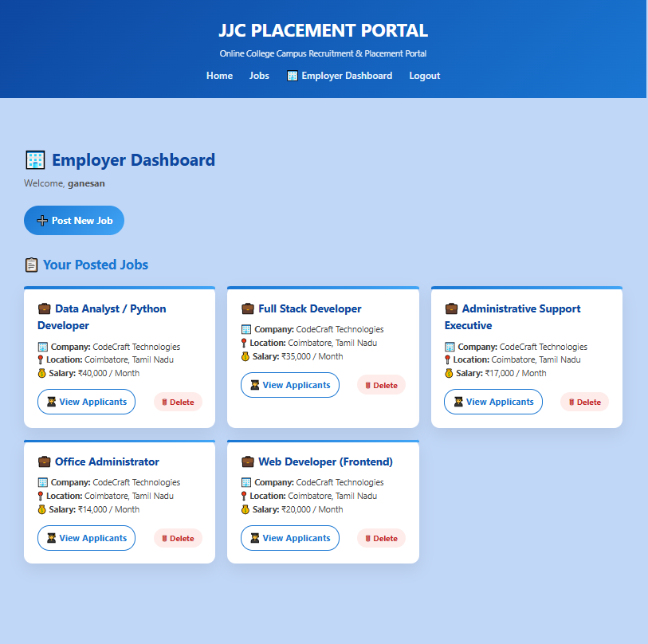
</p>

<p align="center">
  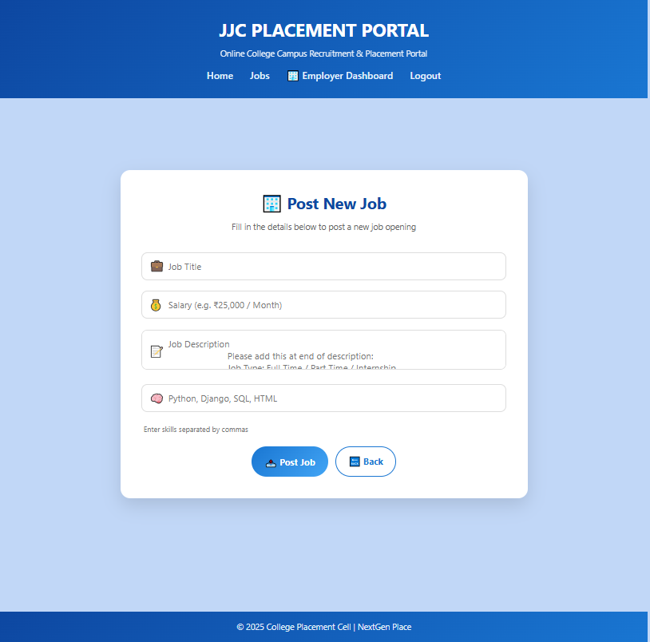
  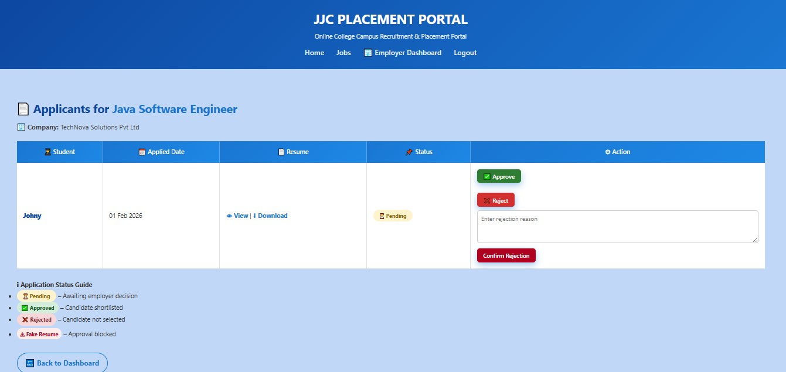
</p>

---

### 🛠 Admin Panel
<p align="center">
  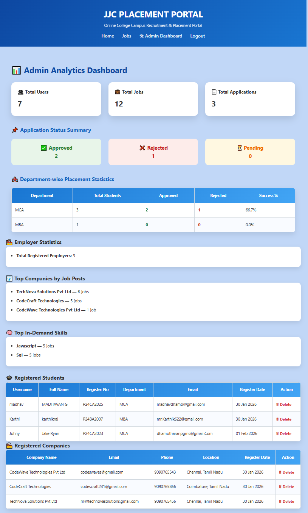
</p>
